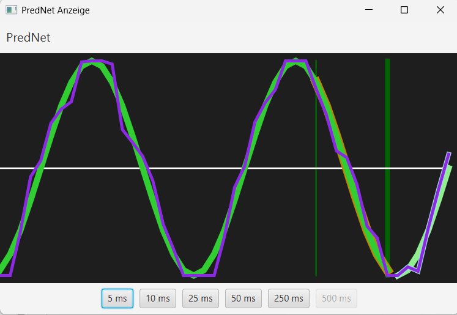
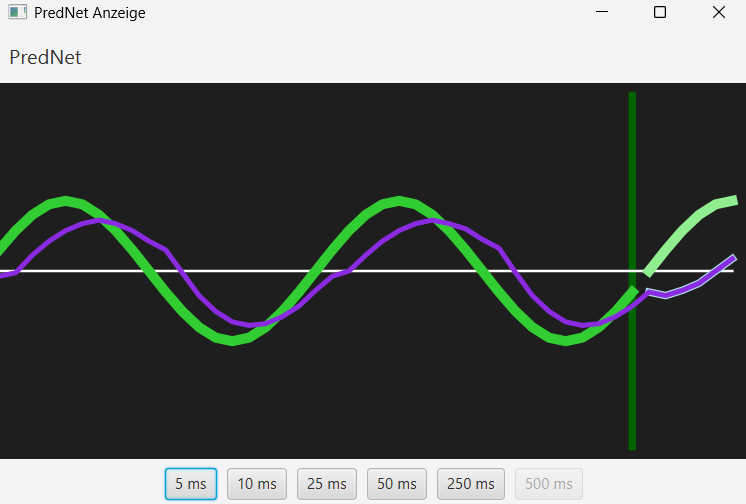

# predNet

Category: Machine Learning

predNet is for building and training predictive neural networks.  
It provides tools for creating models that can learn to predict future data points based on past observations.

Verry good Results, if you receive the actual state and the last predicted future outputs as input

## TODO

* Add one Y-Axis to the input/ output to plot figures.
* Test Memory concepts like LSTM, GRU, etc.